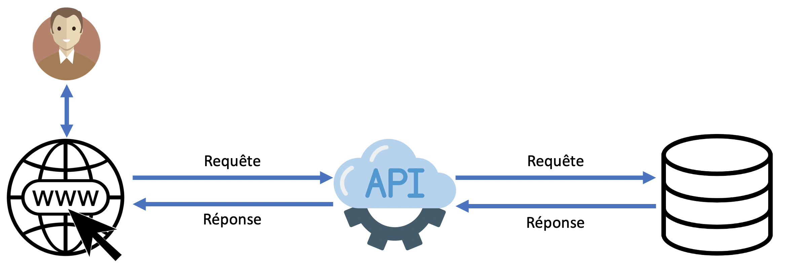
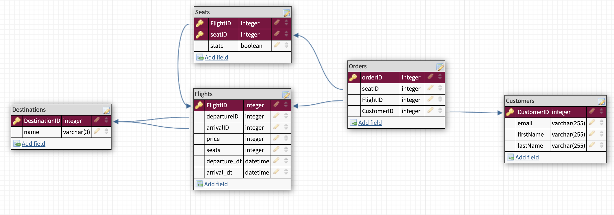
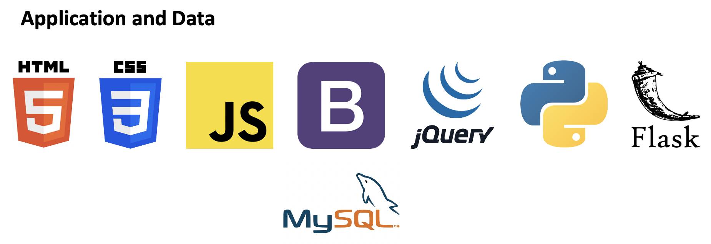

<h1>Architecture globale</h1>
 

<h1>Le modèle de données stockées</h1>
 

 
<h1>La stack technique</h1>
 

 

- UI: Nous allons utiliser l'HTML qui est le langage conçu pour représenter les pages webs (c'est le standard dans ce domaine, donc un must-have pour ce projet). Ensuite nous allons utiliser javascript, pour rendre notre page web dynamique (nous n'excluons pas d'utiliser des bibliothèques JavaScript telles que JQuery). Enfin nous allons utiliser du php, notamment pour faire les appels API. 
	- API: Pour faire l'API, nous allons utiliser Python car déjà des membres de l'équipe ont de l'expérience avec ce langage mais aussi car il y a de nombreux framework qui permettent de construire sa propore API (comme Flask), ce qui simplifiera notre travail. 
	- Base de données: Nous avons choisi une base de données RDBMS car l'équipe a de l'expérience sur ce type de base de données.

 
